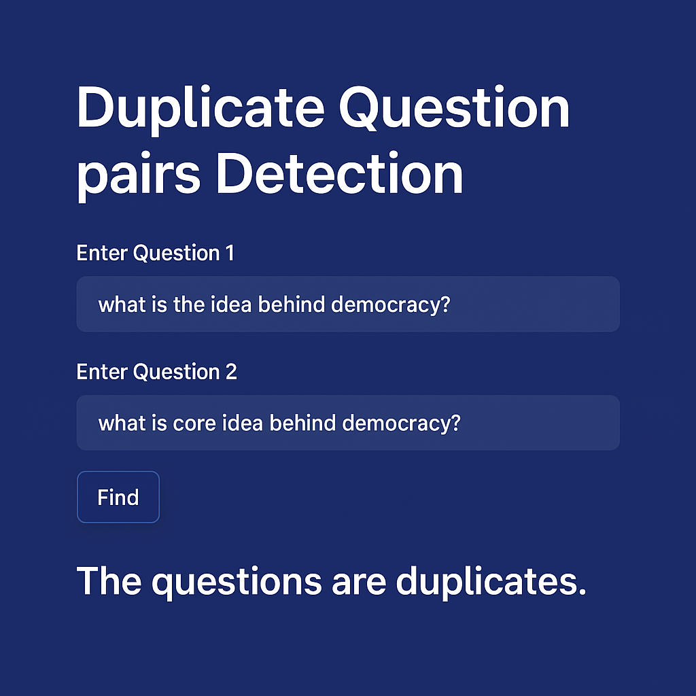

# 🔁 Duplicate Question Detector

This is a **Streamlit web app** that intelligently detects whether two user-entered questions are duplicates — useful for Q&A platforms, forums, or support tools.

🚀 **Live Demo**:  
[Click here to try it out](https://duplicate-quetion-pair-cvaq4vhgijr32kldstpcu8.streamlit.app/)

---

## 📌 Overview

This app uses a **trained machine learning model** (Random Forest) to identify semantic and syntactic similarity between two questions.

It uses a variety of NLP techniques, including:

- ✅ **Text Preprocessing** (cleaning, lowercasing, contraction expansion, etc.)
- ✅ **Token-based Features**
- ✅ **Length-based Features**
- ✅ **Fuzzy Matching**
- ✅ **Bag of Words** (BoW)
- ✅ **Model Compression** using `joblib`

---

## 🧠 How It Works

1. User enters two questions.
2. The questions are cleaned and tokenized.
3. A series of hand-crafted and vector-based features are extracted.
4. The pre-trained model predicts whether the questions are duplicates.
5. The result is shown instantly in the app.

---

## 🛠 Technologies Used

| Category         | Libraries / Tools                  |
|------------------|------------------------------------|
| Web UI           | Streamlit                          |
| NLP              | NLTK, BeautifulSoup, FuzzyWuzzy    |
| ML Model         | Scikit-learn (Random Forest)       |
| Model Compression| Joblib                             |
| Deployment       | Streamlit Cloud                    |

---

## 🖼️ Demo Screenshots

### 🔹 App Home Page and result




## 📦 Installation (Local)

```bash
git clone https://github.com/Pdevshali/Duplicate-Quetion-Pair.git
cd Duplicate-Quetion-Pair
pip install -r requirements.txt
streamlit run app.py
